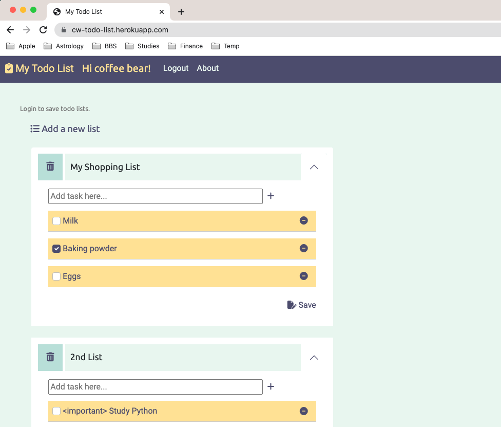

# py07_todoList

This web application project is a homework for *100 Days of Code: The Complete Python Pro Bootcamp for 2022.*

* User need to log in to save todo list
* One user can have maximum of five todo lists, 10 tasks per list.

### Initial DB structure design (Not implemented)

### Reference

* [JQuery - Tree Traversal: Locate elements](https://api.jquery.com/category/traversing/tree-traversal/)
* [JQuery - .append(): Add new todo lists and tasks](https://api.jquery.com/append/)
* [JQuery UI - Sortable: Make tasks sortable](https://jqueryui.com/sortable/)
* [Bootstrap - Accordion: Expand/collapse todo lists](https://getbootstrap.com/docs/5.2/components/accordion/)
* [Convert special characters to HTML in JavaScript - Stack Overflow](https://stackoverflow.com/questions/784586/convert-special-characters-to-html-in-javascript)
* [How to insert into multiple tables to MySQL with sqlalchemy - Stack Overflow](https://stackoverflow.com/questions/27736122/how-to-insert-into-multiple-tables-to-mysql-with-sqlalchemy)
* [Jquery click event not firing on the element created dynamically using jquery - Stack Overflow](https://stackoverflow.com/questions/22610042/jquery-click-event-not-firing-on-the-element-created-dynamically-using-jquery)
* [Using Jquery with Jinja2 to provide onclick event inside a loop on each element - Stack Overflow](https://stackoverflow.com/questions/13423646/using-jquery-with-jinja2-to-provide-onclick-event-inside-a-loop-on-each-element)

